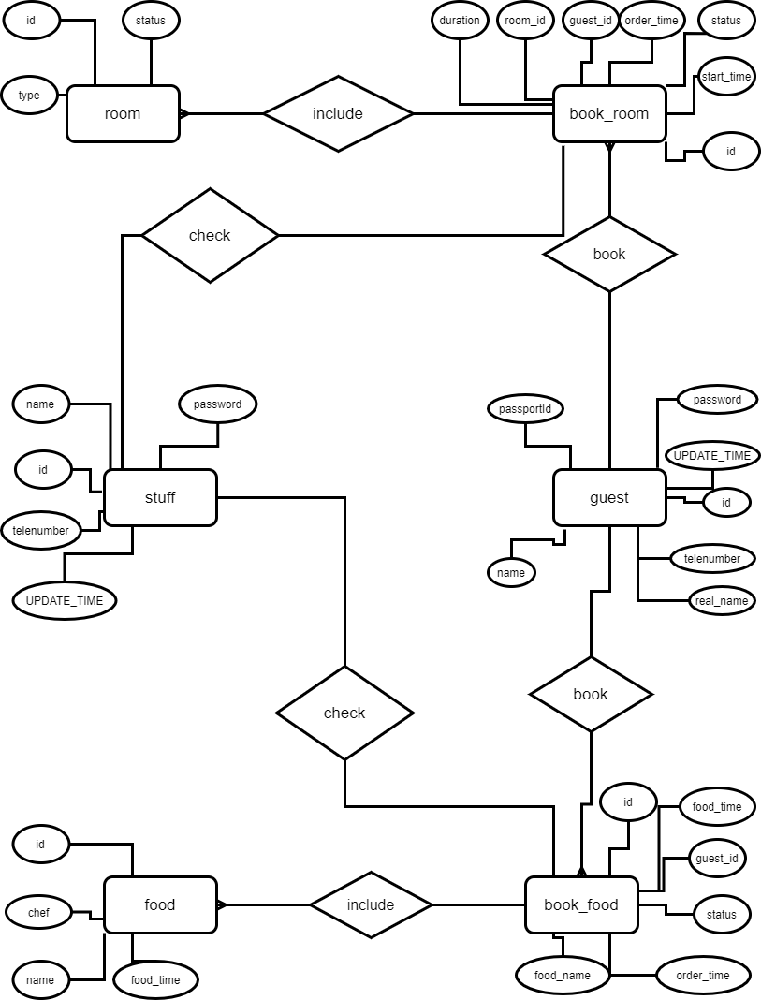

# Java-Hotel-Management-System

[toc]

## System Design ideas

**Overall Architecture**: I tried to use the idea of MVC, the data structure is stored in the Model, the display system is stored in the View, and all the information communicated with the database is stored in the Controller.

**Validity of order**: In each order, status = 1 means the order is valid, status = 0 means the order is invalid (may be expired or cancelled), canceling the order means With set status = 0;

**ID assignment**: The assignment of customer and stuff id is: id <10000 is the stuff id, id> 10000 is the customer id.

**Order management process:** There is a daemon `Book.bookd()` which is used to monitor the status of the room, check whether the room is occupied or expired, and whether the food order is valid.

## User guide

After the user enters the system, choose identity is a stuff or a customer, and you can choose to log in or sign up.

The employees' functions are:

1. According to the type of room to find the status of the room (is there a check-in, or a vacancy).
2. Check the room status according to the room ID,
3. Check all the rooms that have been checked in now,
4. View all rooms that are now empty,
5. View all scheduled food,
6. Check all the reserved rooms,
7. View all existing food.

The customer's functions are:

1. Book a room according to the room type,
2. Book a room according to the room ID,
3. Order food within 3 days from today,
4. Modify private information,
5. Cancel a room that has not been checked in,
6. Cancel the food that has not arrived,
7. View your room order information,
8. View your own food order information,

Select the corresponding serial number for the corresponding function according to the system prompt. It should be noted that when ordering food, you need to enter the name of the dish instead of the serial number.

## Database design

### Specific in tables

There are 6 tables in total, namely:

1. stuff: stuff information form

   1. id:
   2. name
   3. password
   4. telenumber
   5. UPDATED_TIME: the time when the stuff registered

2. guest: customer information table

   1. id
   2. name
   3. real name
   4. password
   5. telenumber
   6. passportId
   7. UPDATED_TIME: the time when the customer registered

3. room: Room information table

   1. id: room id, the last two indicate the room type, the first two indicate the room floor
   2. type: Room type
   3. status: The current status of this room.

4. food: Food information form

   1. id: food id
   2. name: food name
   3. food_time: is a collection, from 1 to 7, representing the day of the week
   4. chef: chef name

5. book_room: room order

   1. id: order id
   2. room_id: room id
   3. guest_id: guest id
   4. start_time: the start time of the room
   5. duration: the duration of the room
   6. status: indicates the status of this order, 0 indicates that it has expired, 1 indicates that it is in progress.
   7. order_time: current time.

6. book_food: Food order

   1. id: order id
   2. food_name: food name
   3. guest_id: guest id
   4. food_time: Food supply time
   5. status: indicates the status of this order, 0 indicates that it has expired, 1 indicates that it is in progress.
   6. order_time: current time.

### Relationship in tables

Guest books room / food will generate raw information in book_room / book_food. Stuff can check book_room / book_food to know every room / food information.

## ER-table

## Default Account

Initial stuff account:
`username`: "init_stuff",
`password`: "init_stuff".

Initial customer account:
`username`: "init_guest",
`password`: "init_guest".

## System Operation Specific

Fill in the `userName`, `passWord`, `DataBaseURL`of the local database in `Controller.ENV`, the system will automatically initialize the database.

Main function is in the /Model/Main.java